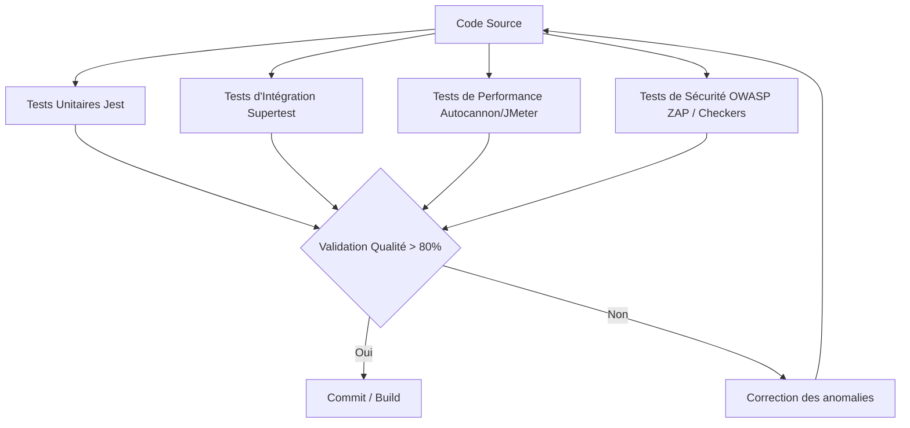

# Plan d'Assurance Qualité (PAQ)
## Projet : BiblioTech - Système de Gestion de Bibliothèque

---

### 1. Présentation du Projet
**BiblioTech** est une application web moderne de gestion de bibliothèque destinée aux établissements universitaires et aux bibliothèques publiques. Elle permet de gérer un catalogue de livres, le cycle de vie des emprunts, les comptes des adhérents et les rôles du personnel (Bibliothécaires et Administrateurs).

L'accent principal de ce projet est mis sur la **qualité logicielle**, en démontrant une rigueur méthodologique inspirée des pratiques industrielles les plus exigeantes.

---

### 2. Objectifs du Système
Le système vise à résoudre les problèmes de suivi manuel ou obsolète des livres et des emprunts :
- **Centralisation** du catalogue de livres avec recherche dynamique et performante.
- **Automatisation** des processus d'emprunt et de retour (avec blocage automatique en cas de quotas dépassés ou de retards).
- **Sécurisation** des données des utilisateurs et prévention des fraudes (accès restreints selon les rôles).
- **Transparence opérationnelle** via un tableau de bord qualité intégré présentant l'état du code et de la sécurité.

---

### 3. Fonctionnalités Prévues
1. **Gestion des Utilisateurs** :
   - Inscription et connexion sécurisées.
   - Gestion des rôles : Lecteur (Adhérent), Bibliothécaire, Administrateur.
2. **Gestion du Catalogue de Livres** :
   - Recherche multicritères (titre, auteur, catégorie, disponibilité).
   - CRUD complet des livres (réservé aux Bibliothécaires/Administrateurs).
3. **Gestion des Emprunts** :
   - Emprunter un livre disponible (limite de 3 livres maximum par lecteur).
   - Retourner un livre (libère l'exemplaire).
   - Suivi des retards et des amendes fictives.
4. **Tableau de Bord Qualité & Incidents** :
   - Visualisation des rapports de qualité (SonarQube, OWASP ZAP, JMeter).
   - Module de gestion des incidents simulés (panne serveur, indisponibilité de la base de données).

---

### 4. Normes et Référentiels Utilisés
- **ISO/IEC 25010** : Modèle de qualité du produit logiciel, structurant l'évaluation du système.
- **ITIL v4** : Cadre de gestion des services informatiques pour la gestion des incidents, des problèmes et des changements.
- **CMMI-DEV v2.0** : Évaluation du niveau de maturité des processus de développement.
- **OWASP Top 10** : Directives de sécurité pour protéger l'application contre les failles courantes.

---

### 5. Critères de Qualité ISO/IEC 25010
Nous ciblons les caractéristiques suivantes :

| Caractéristique | Sous-caractéristique concernée | Critère de validation |
| :--- | :--- | :--- |
| **Sécurité** | Confidentialité, Intégrité, Authenticité | Hachage des mots de passe (bcrypt), sessions JWT expirables, protection XSS/CSRF/Injections SQL. |
| **Performance** | Comportement temporel, Utilisation des ressources | Temps de réponse moyen < 200 ms sous charge normale (100 requêtes/sec). Consommation RAM stable. |
| **Maintenabilité** | Modularité, Analysabilité, Testabilité | Architecture MVC en couches distinctes. Couverture de code Jest/Supertest > 80%. Index de maintenabilité SonarQube : A. |
| **Fiabilité** | Tolérance aux pannes, Capacité de récupération | Gestion globale des exceptions (pas de plantage de processus Express). Base SQLite robuste avec transactions ACID. |
| **Utilisabilité** | Esthétique, Facilité d'apprentissage, Protection contre les erreurs | UI moderne, responsive (Glassmorphism, animations CSS fluides), validation des formulaires côté client et serveur. |
| **Compatibilité** | Coexistence | Fonctionnement sans conflit sur Chrome, Firefox, Edge, Safari. |
| **Portabilité** | Installabilité | Projet facilement installable sur Windows/macOS/Linux via `npm install` et `npm start`. |

---

### 6. Procédure de Développement
- **Gestion des sources** : Utilisation de Git. Les branches respectent le modèle suivant :
  - `main` : Code stable de production.
  - `develop` : Code d'intégration des fonctionnalités validées.
  - `feature/nom-fonctionnalite` : Développement de fonctionnalités spécifiques.
- **Conventions de codage** :
  - Formatage automatique avec Prettier.
  - Analyse statique de code via ESLint.
  - Nommage camelCase pour les variables/fonctions, PascalCase pour les classes, UPPER_CASE pour les constantes.
- **Processus de commit** : Les commits doivent être réguliers et explicites, en suivant la norme *Conventional Commits* :
  - `feat: ...` (nouvelle fonctionnalité)
  - `fix: ...` (correction de bug)
  - `test: ...` (tests unitaires ou d'intégration)
  - `docs: ...` (documentation)
  - `refactor: ...` (modification du code sans changement de comportement)

---

### 7. Stratégie de Tests
Les tests sont automatisés avec **Jest** et **Supertest** et exécutés avant chaque phase de commit majeure.

- **Tests Fonctionnels & Validation** : Validation des cas d'utilisation nominaux (connexion, emprunt, retour).
- **Tests de Limites / Robustesse** : Tenter d'emprunter 4 livres, emprunter un livre déjà prêté, saisir des données invalides.
- **Tests de Sécurité** : Injection SQL (vérification de la paramétrisation des requêtes SQLite), XSS (échappement EJS), force brute.
- **Tests de Performance** : Test de charge de 100 requêtes concurrentes pour mesurer la latence et s'assurer qu'aucun goulot d'étranglement n'existe.

---

### 8. Procédure de Validation et de Recette
Chaque fonctionnalité doit être validée par le "Testeur" de l'équipe :
1. Déploiement de la version candidate.
2. Exécution du plan de test complet (manuel et automatisé).
3. Comparaison des résultats avec les critères ISO/IEC 25010.
4. Validation si 100% des tests critiques (bloquants) passent et si la couverture de test Jest est >= 80%.

---

### 9. Gestion des Anomalies (Bugs)
Les anomalies détectées sont consignées dans un outil de ticketing (simulé ou via GitHub Issues) avec le cycle suivant :
1. **Détection** : Saisie de l'anomalie avec description, étapes de reproduction, comportement attendu vs obtenu, et sévérité.
2. **Priorisation** :
   - *Bloquante* : Empêche l'utilisation d'une fonctionnalité clé (ex: impossible de se connecter).
   - *Majeure* : Dysfonctionnement important mais contournable.
   - *Mineure* : Problème esthétique ou d'ergonomie.
3. **Résolution** : Assignation à un développeur et création d'une branche `fix/nom-bug`.
4. **Validation** : Re-test par le testeur et fusion dans `develop`.

---

### 10. Outils Qualité et Configuration
- **SonarQube** : Analyse de la dette technique et de la structure du code (`sonar-project.properties`).
- **OWASP ZAP** : Scan automatique des vulnérabilités web.
- **Apache JMeter** : Fichier `.jmx` pour simuler le comportement du serveur sous charge.
- **GLPI / Zammad** : Gestion des tickets d'incidents (pannes serveur, plaintes utilisateurs) et des changements de configuration.
