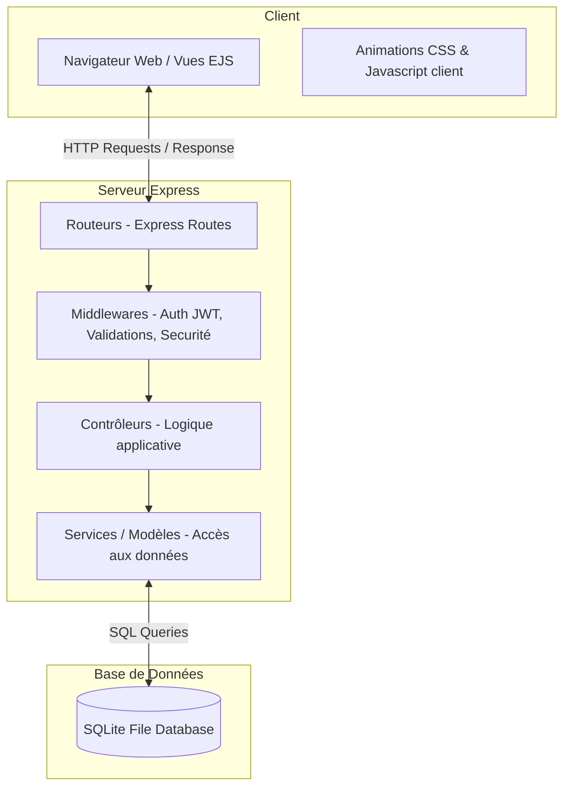
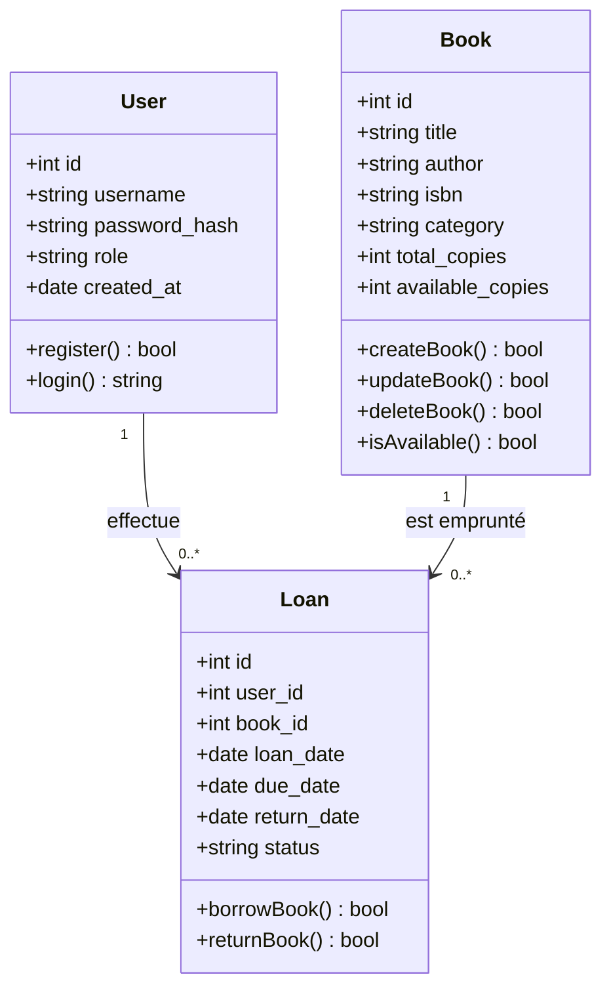
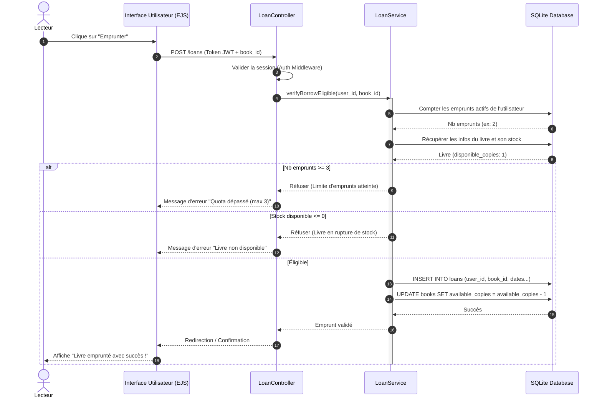

# Dossier de Conception Logicielle (UML & Architecture)
## Projet : BiblioTech

Ce document formalise la phase de conception de l'application BiblioTech. Il présente l'architecture logicielle, les diagrammes UML (Mermaid) et le modèle physique des données.

---

### 1. Architecture du Système
BiblioTech utilise une architecture en **couches (MVC - Model-View-Controller)** pour garantir une séparation claire des responsabilités, une modularité maximale et une excellente maintenabilité (critères ISO/IEC 25010).



---

### 2. Diagramme de Cas d'Utilisation
Ce diagramme détaille les actions possibles selon les rôles des utilisateurs.

```mermaid
leftToRightDirection
actor "Lecteur (Adhérent)" as Adh
actor "Bibliothécaire" as Biblio
actor "Administrateur" as Admin

Admin --|> Biblio
Biblio --|> Adh

rectangle BiblioTech_System {
    usecase "S'authentifier" as Auth
    usecase "Rechercher un livre" as Search
    usecase "Emprunter un livre" as Borrow
    usecase "Retourner un livre" as Return
    usecase "Gérer le catalogue (CRUD)" as ManageCatalog
    usecase "Gérer les adhérents" as ManageUsers
    usecase "Visualiser le tableau de bord Qualité" as ViewDashboard
}

Adh --> Auth
Adh --> Search
Adh --> Borrow
Adh --> Return

Biblio --> ManageCatalog
Biblio --> ManageUsers

Admin --> ViewDashboard
```

---

### 3. Diagramme de Classes
Modèle logique des objets manipulés dans le système.



---

### 4. Diagramme de Séquence : Processus d'Emprunt
Ce diagramme décrit la séquence d'actions et les vérifications lors d'un emprunt de livre.



---

### 5. Modèle Physique de Données (Base de Données)
La base de données est relationnelle. Le schéma SQL se décline ainsi :

#### Table `users`
Stocke les informations d'authentification et de rôles.
- `id` : INTEGER PRIMARY KEY AUTOINCREMENT
- `username` : VARCHAR(50) UNIQUE NOT NULL
- `password_hash` : VARCHAR(255) NOT NULL
- `role` : VARCHAR(20) DEFAULT 'lecteur' (valeurs possibles : 'lecteur', 'bibliothecaire', 'admin')
- `created_at` : DATETIME DEFAULT CURRENT_TIMESTAMP

#### Table `books`
Catalogue des livres en stock.
- `id` : INTEGER PRIMARY KEY AUTOINCREMENT
- `title` : VARCHAR(255) NOT NULL
- `author` : VARCHAR(255) NOT NULL
- `isbn` : VARCHAR(20) UNIQUE NOT NULL
- `category` : VARCHAR(100) NOT NULL
- `total_copies` : INT DEFAULT 1
- `available_copies` : INT DEFAULT 1

#### Table `loans`
Historique et état des emprunts.
- `id` : INTEGER PRIMARY KEY AUTOINCREMENT
- `user_id` : INT FOREIGN KEY REFERENCES `users`(id) ON DELETE CASCADE
- `book_id` : INT FOREIGN KEY REFERENCES `books`(id) ON DELETE CASCADE
- `loan_date` : DATETIME DEFAULT CURRENT_TIMESTAMP
- `due_date` : DATETIME NOT NULL
- `return_date` : DATETIME (NULL si non retourné)
- `status` : VARCHAR(20) DEFAULT 'actif' ('actif', 'retourne', 'en_retard')

---

### 6. Conception de l'Interface Utilisateur (Maquettes)
L'application propose 4 vues principales :
1. **Page de Connexion / Inscription** : Formulaire central épuré, design sombre avec effet de flou d'arrière-plan (glassmorphism).
2. **Dashboard Lecteur** :
   - Barre de recherche de livres en temps réel.
   - Liste des livres empruntés avec indicateur visuel de date limite (Vert si OK, Rouge si en retard).
   - Bouton d'emprunt direct.
3. **Dashboard Bibliothécaire / Administration** :
   - Formulaires d'ajout et d'édition de livres avec contrôles d'erreurs en direct.
   - Liste exhaustive de tous les emprunts avec possibilité de forcer le retour ou d'appliquer une amende fictive.
4. **Dashboard Qualité Logicielle (Admin uniquement)** :
   - Panneau affichant des indicateurs interactifs de la qualité du code (taux de couverture, nombre d'alertes de sécurité, temps de réponse sous charge).
   - Section ITIL permettant de simuler des pannes serveurs et de visualiser l'incident dans le journal système.
